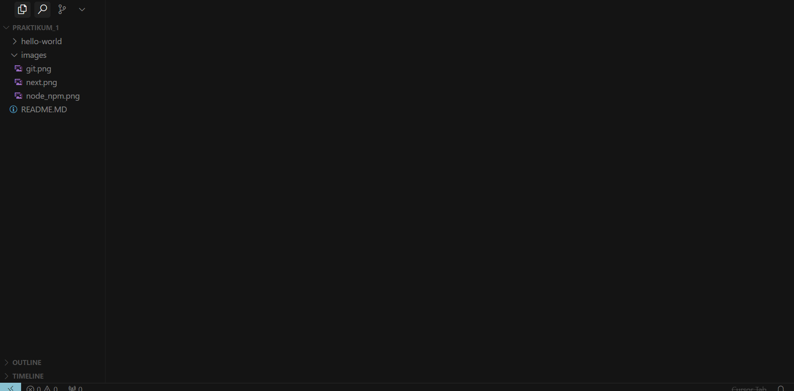
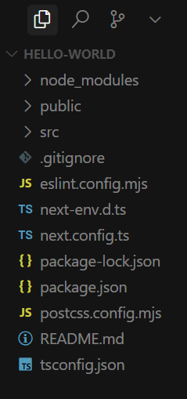

# Praktikum 1: Pengantar Pemrograman Berbasis Framework Dan ReactJS

## Step 1

### Instalasi Git

1. Download Git dari [git-scm.com](https://git-scm.com)
2. Jalankan installer dan ikuti langkah-langkah instalasi
3. Verifikasi instalasi dengan menjalankan perintah `git --version` di terminal

   

### Instalasi VS Code

1. Download VS Code dari [code.visualstudio.com](https://code.visualstudio.com)
2. Pilih versi yang sesuai dengan sistem operasi Anda (Windows/Mac/Linux)
3. Jalankan installer dan ikuti langkah-langkah instalasi
4. Setelah instalasi selesai, buka VS Code

   

### Instalasi Next.js

1. Pastikan Node.js dan NPM sudah terinstal
2. Buat project Next.js baru dengan perintah:

   ```bash
   npx create-next-app@latest my-app
   ```

3. Ikuti instruksi yang muncul di terminal
   

### Instalasi Node dan NPM

1. Download Node.js dari [nodejs.org](https://nodejs.org)
2. Pilih versi LTS (Long Term Support)
3. Jalankan installer dan ikuti langkah-langkah instalasi
4. Verifikasi instalasi dengan menjalankan:

   ```bash
   node --version
   npm --version
   ```

   

### Pertanyaan

#### 1. Jelaskan kegunaan masing-masing dari Git, VS Code dan NodeJS yang telah Anda install pada sesi praktikum ini!

**Jawaban:**

1. **Git**

   - Git adalah sistem kontrol versi terdistribusi yang digunakan untuk melacak perubahan dalam kode sumber
   - Memungkinkan kolaborasi antar developer dalam pengembangan software
   - Fitur utama:
     - Version control (pengelolaan versi kode)
     - Branching dan merging (pembuatan cabang dan penggabungan kode)
     - Tracking changes (pelacakan perubahan)
     - Remote repository (penyimpanan kode di server)

2. **VS Code (Visual Studio Code)**

   - VS Code adalah editor kode sumber yang ringan namun powerful
   - Fitur utama:
     - Syntax highlighting (penyorotan sintaks)
     - IntelliSense (pelengkapan kode otomatis)
     - Debugging (pencarian bug)
     - Git integration (integrasi dengan Git)
     - Extensions (ekstensi untuk menambah fungsionalitas)
     - Terminal terintegrasi
     - Multi-language support (mendukung berbagai bahasa pemrograman)

3. **NodeJS**
   - NodeJS adalah runtime environment JavaScript di sisi server
   - Fitur utama:
     - Menjalankan JavaScript di luar browser
     - Package manager (NPM) untuk mengelola dependensi
     - Event-driven dan non-blocking I/O
     - Mendukung pengembangan aplikasi web real-time
     - Memungkinkan pengembangan full-stack JavaScript
     - Mendukung berbagai framework seperti Express.js, Next.js, dll

## Step 2

### Direktori `hello-world`

Setelah membuat proyek Next.js baru, kita akan mendapatkan struktur direktori seperti berikut:



### Menjalankan `hello-world` (Proyek Next.js)

Untuk menjalankan proyek Next.js, kita perlu melakukan compile terlebih dahulu dengan perintah:

```bash
npm run dev
```

Setelah menjalankan perintah tersebut, kita akan melihat proses compile seperti berikut:


### Halaman default Next.j

Setelah proses compile selesai, aplikasi Next.js akan berjalan di `http://localhost:3000`. Halaman default Next.js akan muncul seperti berikut:


### Pertanyaan

#### 1. Pada Langkah ke-2, setelah membuat proyek baru menggunakan Next.js, terdapat beberapa istilah yang muncul. Jelaskan istilah tersebut!

**Jawaban:**

1. **TypeScript**

   - Bahasa pemrograman yang merupakan superset dari JavaScript
   - Menambahkan fitur static typing ke JavaScript
   - Membantu mendeteksi error lebih awal dalam proses development
   - Meningkatkan maintainability dan readability kode

2. **ESLint**

   - Tool untuk static code analysis
   - Membantu menemukan dan memperbaiki masalah dalam kode JavaScript/TypeScript
   - Menegakkan aturan coding style yang konsisten
   - Mencegah bug dan error umum

3. **Tailwind CSS**

   - Framework CSS utility-first
   - Menyediakan class-class utility untuk styling
   - Memungkinkan styling langsung di HTML/JSX
   - Membuat development lebih cepat dan konsisten

4. **App Router**

   - Sistem routing baru di Next.js 13+
   - Berbasis folder structure
   - Mendukung nested layouts
   - Memungkinkan loading states dan error handling yang lebih baik

5. **Import Alias**

   - Fitur untuk menyederhanakan import path
   - Menggunakan simbol seperti '@' untuk mereferensikan direktori
   - Membuat import lebih rapi dan mudah dibaca
   - Menghindari relative path yang panjang

6. **Turbopack**
   - Bundler dan compiler baru dari tim Next.js
   - Pengganti Webpack yang lebih cepat
   - Mengoptimalkan development experience
   - Mendukung hot module replacement yang lebih cepat

#### 2. Apa saja kegunaan folder dan file yang ada pada struktur proyek React yang tampil pada gambar pada tahap percobaan ke-3!

**Jawaban:**

1. **Folder `app/`**

   - Direktori utama untuk routing dan komponen
   - Berisi file-file yang menentukan route aplikasi
   - Mendukung App Router Next.js
   - Tempat menyimpan layout dan halaman

2. **Folder `public/`**

   - Menyimpan aset statis
   - Berisi gambar, font, dan file statis lainnya
   - Dapat diakses langsung dari browser
   - Tidak diproses oleh webpack

3. **File `package.json`**

   - Menyimpan informasi proyek
   - Daftar dependensi dan script
   - Konfigurasi proyek
   - Metadata proyek

4. **File `next.config.js`**

   - File konfigurasi Next.js
   - Mengatur behavior framework
   - Konfigurasi build dan development
   - Pengaturan environment

5. **File `tsconfig.json`**

   - Konfigurasi TypeScript
   - Mengatur compiler options
   - Path aliases
   - Type checking rules

6. **File `.gitignore`**
   - Menentukan file/folder yang diabaikan Git
   - Mencegah file sensitif masuk ke repository
   - Mengabaikan file build dan dependencies
   - Mengoptimalkan ukuran repository

## Step 3

### Menambahkan Komponen MyButton

Pada langkah ini, kita akan menambahkan komponen `MyButton` ke dalam halaman utama Next.js. Berikut adalah kode yang ditambahkan:

```typescript
// src/app/page.tsx
import Image from "next/image";

export default function Home() {
  // PRAKTIKUM 3 (MENAMBAHKAN FUNGSI MYBUTTON)
  function MyButton() {
    return (
      <a href="http://localhost:3000" target="_blank" rel="noopener noreferrer" className="px-4 py-2 bg-blue-500 text-white rounded-lg hover:bg-blue-600 transition duration-300">
        Buka Halaman
      </a>
    );
  }

  return (
    <div className="grid grid-rows-[20px_1fr_20px] items-center justify-items-center min-h-screen p-8 pb-20 gap-16 sm:p-20 font-[family-name:var(--font-geist-sans)]">
      <main className="flex flex-col gap-[32px] row-start-2 items-center sm:items-start">
        <Image className="dark:invert" src="/next.svg" alt="Next.js logo" width={180} height={38} priority />

        <ol className="list-inside list-decimal text-sm/6 text-center sm:text-left font-[family-name:var(--font-geist-mono)]">
          <li className="mb-2 tracking-[-.01em]">
            Get started by editing <code className="bg-black/[.05] dark:bg-white/[.06] px-1 py-0.5 rounded font-[family-name:var(--font-geist-mono)] font-semibold">src/app/page.tsx</code>
          </li>
          <li className="tracking-[-.01em]">Save and see your changes instantly.</li>
        </ol>

        <div className="flex gap-4 items-center flex-col sm:flex-row">
          {/* Tombol-tombol default Next.js */}
          <a
            className="rounded-full border border-solid border-transparent transition-colors flex items-center justify-center bg-foreground text-background gap-2 hover:bg-[#383838] dark:hover:bg-[#ccc] font-medium text-sm sm:text-base h-10 sm:h-12 px-4 sm:px-5 sm:w-auto"
            href="https://vercel.com/new"
            target="_blank"
            rel="noopener noreferrer"
          >
            <Image className="dark:invert" src="/vercel.svg" alt="Vercel logomark" width={20} height={20} />
            Deploy now
          </a>

          <a
            className="rounded-full border border-solid border-black/[.08] dark:border-white/[.145] transition-colors flex items-center justify-center hover:bg-[#f2f2f2] dark:hover:bg-[#1a1a1a] hover:border-transparent font-medium text-sm sm:text-base h-10 sm:h-12 px-4 sm:px-5 w-full sm:w-auto md:w-[158px]"
            href="https://nextjs.org/docs"
            target="_blank"
            rel="noopener noreferrer"
          >
            Read our docs
          </a>

          {/* PRAKTIKUM 3: MENAMBAHKAN MY BUTTON DIDALAM HOME */}
          <MyButton />
        </div>
      </main>

      <footer className="row-start-3 flex gap-[24px] flex-wrap items-center justify-center">
        {/* Footer links */}
        <a className="flex items-center gap-2 hover:underline hover:underline-offset-4" href="https://nextjs.org/learn" target="_blank" rel="noopener noreferrer">
          <Image aria-hidden src="/file.svg" alt="File icon" width={16} height={16} />
          Learn
        </a>
        <a className="flex items-center gap-2 hover:underline hover:underline-offset-4" href="https://vercel.com/templates" target="_blank" rel="noopener noreferrer">
          <Image aria-hidden src="/window.svg" alt="Window icon" width={16} height={16} />
          Examples
        </a>
        <a className="flex items-center gap-2 hover:underline hover:underline-offset-4" href="https://nextjs.org" target="_blank" rel="noopener noreferrer">
          <Image aria-hidden src="/globe.svg" alt="Globe icon" width={16} height={16} />
          Go to nextjs.org →
        </a>
      </footer>
    </div>
  );
}
```

### Tampilan Next.js (Setelah ditambah MyButton)


Perubahan yang terlihat:

1. Tombol "Buka Halaman" baru muncul di samping tombol default
2. Tombol memiliki style:
   - Background biru (`bg-blue-500`)
   - Teks putih (`text-white`)
   - Rounded corners (`rounded-lg`)
   - Hover effect (`hover:bg-blue-600`)
   - Transisi halus (`transition duration-300`)

#### Apa saja perubahan yang dilakukan pada kode Next.js?

1. **Penambahan Komponen MyButton**

   ```typescript
   function MyButton() {
     return (
       <a href="http://localhost:3000" target="_blank" rel="noopener noreferrer" className="px-4 py-2 bg-blue-500 text-white rounded-lg hover:bg-blue-600 transition duration-300">
         Buka Halaman
       </a>
     );
   }
   ```

2. **Integrasi MyButton ke Layout**

   ```typescript
   <div className="flex gap-4 items-center flex-col sm:flex-row">
     {/* Tombol-tombol default */}
     ...
     {/* PRAKTIKUM 3: MENAMBAHKAN MY BUTTON DIDALAM HOME */}
     <MyButton />
   </div>
   ```

## Step 4

### Menambahkan komponen Profile

Pada langkah ini, kita akan menambahkan komponen `Profile` yang menampilkan informasi developer. Berikut adalah kode yang ditambahkan:

```typescript
// src/app/page.tsx
import Image from "next/image";

export default function Home() {
  // PRAKTIKUM 4 (MENAMBAHKAN FUNGSI PROFILE)
  function Profile() {
    return (
      <div className="flex flex-col items-center gap-2">
        <div className="text-xs text-gray-600">Developed by: {user.name}</div>
        
      </div>
    );
  }

  // Data user
  const user = {
    name: "Fulanah bin Fulan",
    imageUrl: "https://i.imgur.com/yXOvdOSs.jpg",
    imageSize: 90,
  };

  return (
    <div className="grid grid-rows-[20px_1fr_20px] items-center justify-items-center min-h-screen p-8 pb-20 gap-16 sm:p-20 font-[family-name:var(--font-geist-sans)]">
      <main className="flex flex-col gap-[32px] row-start-2 items-center sm:items-start">
        <Image className="dark:invert" src="/next.svg" alt="Next.js logo" width={180} height={38} priority />
        <ol className="list-inside list-decimal text-sm/6 text-center sm:text-left font-[family-name:var(--font-geist-mono)]">
          <li className="mb-2 tracking-[-.01em]">
            Get started by editing <code className="bg-black/[.05] dark:bg-white/[.06] px-1 py-0.5 rounded font-[family-name:var(--font-geist-mono)] font-semibold">src/app/page.tsx</code>
          </li>
          <li className="tracking-[-.01em]">Save and see your changes instantly.</li>
        </ol>

        <div className="flex gap-4 items-center flex-col sm:flex-row">
          {/* Tombol-tombol default Next.js */}
          <a
            className="rounded-full border border-solid border-transparent transition-colors flex items-center justify-center bg-foreground text-background gap-2 hover:bg-[#383838] dark:hover:bg-[#ccc] font-medium text-sm sm:text-base h-10 sm:h-12 px-4 sm:px-5 sm:w-auto"
            href="https://vercel.com/new"
            target="_blank"
            rel="noopener noreferrer"
          >
            <Image className="dark:invert" src="/vercel.svg" alt="Vercel logomark" width={20} height={20} />
            Deploy now
          </a>

          <a
            className="rounded-full border border-solid border-black/[.08] dark:border-white/[.145] transition-colors flex items-center justify-center hover:bg-[#f2f2f2] dark:hover:bg-[#1a1a1a] hover:border-transparent font-medium text-sm sm:text-base h-10 sm:h-12 px-4 sm:px-5 w-full sm:w-auto md:w-[158px]"
            href="https://nextjs.org/docs"
            target="_blank"
            rel="noopener noreferrer"
          >
            Read our docs
          </a>

          {/* PRAKTIKUM 3: MENAMBAHKAN MY BUTTON DIDALAM HOME */}
          <MyButton />
        </div>

        {/* PRAKTIKUM 3: MENAMBAHKAN PROFILE DIDALAM HOME */}
        <Profile />
      </main>

      <footer className="row-start-3 flex gap-[24px] flex-wrap items-center justify-center">
        {/* Footer links */}
        <a className="flex items-center gap-2 hover:underline hover:underline-offset-4" href="https://nextjs.org/learn" target="_blank" rel="noopener noreferrer">
          <Image aria-hidden src="/file.svg" alt="File icon" width={16} height={16} />
          Learn
        </a>
        <a className="flex items-center gap-2 hover:underline hover:underline-offset-4" href="https://vercel.com/templates" target="_blank" rel="noopener noreferrer">
          <Image aria-hidden src="/window.svg" alt="Window icon" width={16} height={16} />
          Examples
        </a>
        <a className="flex items-center gap-2 hover:underline hover:underline-offset-4" href="https://nextjs.org" target="_blank" rel="noopener noreferrer">
          <Image aria-hidden src="/globe.svg" alt="Globe icon" width={16} height={16} />
          Go to nextjs.org →
        </a>
      </footer>
    </div>
  );
}
```

#### Perubahan yang Dilakukan:

1. **Penambahan Komponen Profile**

   ```typescript
   function Profile() {
     return (
       <div className="flex flex-col items-center gap-2">
         <div className="text-xs text-gray-600">Developed by: {user.name}</div>
         
       </div>
     );
   }
   ```

2. **Data User**

   ```typescript
   const user = {
     name: "Fulanah bin Fulan",
     imageUrl: "https://i.imgur.com/yXOvdOSs.jpg",
     imageSize: 90,
   };
   ```

3. **Integrasi Profile ke Layout**

   ```typescript
     // ... existing code ...
          <MyButton />
        </div>

     {/* PRAKTIKUM 3: MENAMBAHKAN PROFILE DIDALAM HOME */}
     <Profile />
     // ... existing code ...
   </main>
   ```

### Tampilan Next.js (Setelah ditambah Profile)


Perubahan yang terlihat:

1. Informasi developer muncul di bawah logo Next.js
2. Profile memiliki style:
   - Teks kecil dan abu-abu (`text-xs text-gray-600`)
   - Gambar profil bulat (`rounded-full`)
   - Border tipis (`border-2 border-gray-200`)
   - Ukuran gambar 90x90 pixel
   - Layout flex column dengan gap

### Pertanyaan

#### Untuk apakah kegunaan sintaks user.imageUrl?

Sintaks `user.imageUrl` digunakan untuk mengakses URL gambar profil dari objek `user`. URL ini kemudian digunakan untuk menampilkan gambar profil dalam komponen `Profile`.
